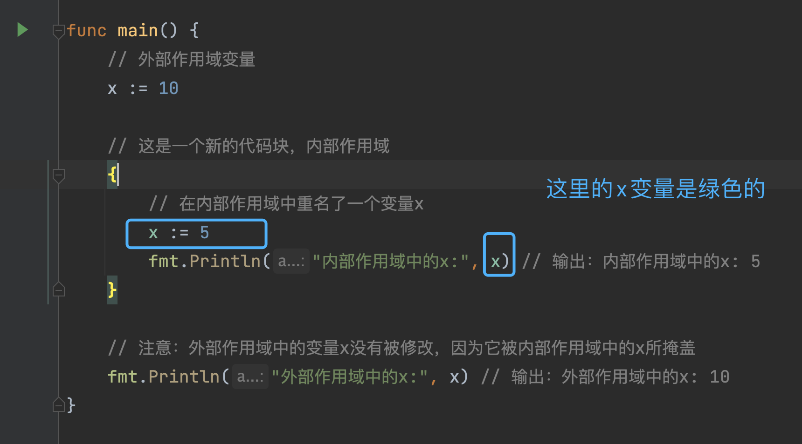

# 第2章:代码与项目组织

## 变量重名
```go
package main

import "fmt"

func main() {
	// 外部作用域变量
	x := 10

	// 这是一个新的代码块，内部作用域
	{
		// 在内部作用域中重名了一个变量x
		x := 5
		fmt.Println("内部作用域中的x:", x) // 输出：内部作用域中的x: 5
	}

	// 注意：外部作用域中的变量x没有被修改，因为它被内部作用域中的x所掩盖
	fmt.Println("外部作用域中的x:", x) // 输出：外部作用域中的x: 10
}

```
output:
```
内部作用域中的x: 5
外部作用域中的x: 10
```
解决办法

这年头,IDE goland 已经能识别这个风险了,新作用域内的x变量会变成绿色字体的


用一个临时变量tmpX来过渡,防止2个地方的`x`变量指向的混淆
```go
x:=10
{
	tmpX:=5
	x=tmpX
}
```

要么不用`:=`
```go
var x int
x=10
{
	x=5
}
```

## 代码嵌套
即`卫语句`概念,不懂的可以wiki下
```
if（it == 活的）{
 

    if（it == 人）{
 

        if（it ！= 女人）{
 

            return 不喜欢；

        } else {
 

            return 喜欢；

        }

    } else {
 

        return 不喜欢；

    }

} else {
 

    return 不喜欢；

}
```
改成如下
```
if （it ！= 活的）{return 不喜欢}

if（it！=人）{return 不喜欢}

if（it！=女人）{return 不喜欢}

if（it == 女人 && it == 活的） {return 喜欢}

if（其他任何情况）{return 不喜欢}
```

## init 函数使用场景